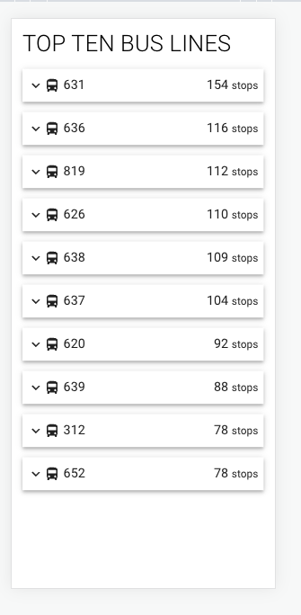

### Description
* Frameworks, Expressjs on server and React on frontend.
* Covered with test cases on both server and client.
* Please view in mobile mode as well.
* The stops are not ordered, as assignment stated.

### How to run
* Have Node installed on the machine
* npm install
* create a .env file in the server folder and paste your API key as
TRAFIK_KEY="0000000000" from [trafiklab](https://www.trafiklab.se/docs/using-trafiklab/getting-api-keys/) or I can send over my key
* npm test
* npm start

